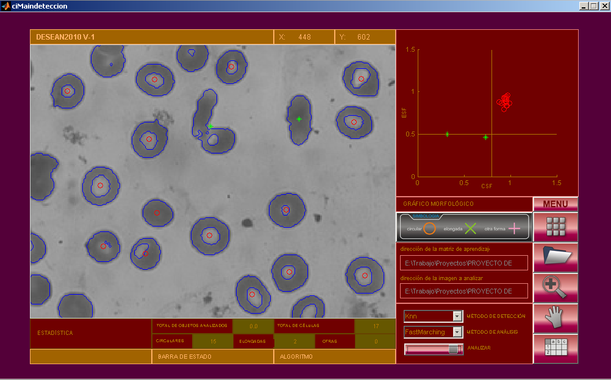

# Cell-segmentation #

Conteo Automatizado de Eritrocitos en Muestras de Sangre.

Pedro Diamel Marrero Fernandez

La deformación de células en sangre es provocada por algunas enfermedades, como la Anemia Drepanocítica o Sicklemia, que afecta al 3% de la población cubana y provoca el endurecimiento o polimerización de la hemoglobina que contienen los eritrocitos en sangre y su deformación.
La información sobre estas células es necesaria para apoyar el diagnóstico sobre el nivel de afectación del organismo o la respuesta a medicamentos empleados. En estos momentos en Santiago de Cuba la deformación de eritrocitos en sangre se estudia por un especialista con un microscopio, proceso engorroso y propenso a errores que requiere un alto costo de tiempo y personal capacitado, por lo que no es profundo y solamente aporta una apreciación personal del especialista sobre el nivel de afectación del paciente. El objetivo de este trabajo es obtener automáticamente el conteo de eritrocitos deformados en imágenes de muestras de sangre, empleando técnicas de procesamiento de imágenes digitales para detectar los objetos de interés considerando su textura, aplicar métodos de evolución de contornos para obtener bordes de las células y realizar un análisis morfológico sobre los bordes detectados para determinar cuántas están deformadas. 
Se emplearon 45 imágenes de muestras de sangre de pacientes sicklémicos, se obtuvo la cantidad de eritrocitos deformados con una efectividad de 75%, considerado favorable dadas las condiciones de desarrollo del proceso actual. La validación estadística contó con el criterio de una especialista en 1er grado en MGI y Laboratorio Clínico del Departamento de  Hematología Especial del Hospital General “Dr. Juan Bruno Zayas”.

How to use it
-------------

### Aplication

